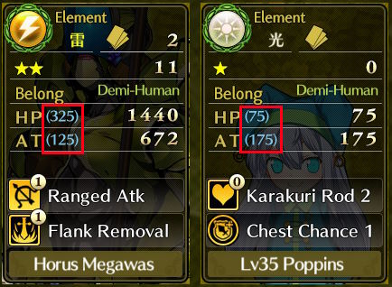
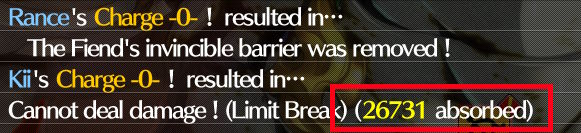
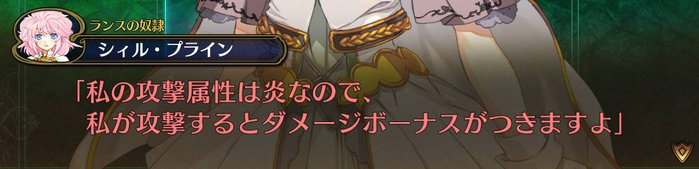
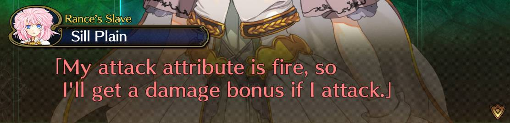

# Rance 10 — English patch

## How to install it

You need Rance 10, version **1.04**. The patch is a few files you copy into game directory.

1. **Download the patch.** From the [Releases page](https://github.com/SanyaBane/rance-10-gpt-mtl/releases),
   take the newest file whose name starts with `rance10-en_grok`, and unzip it.
2. **Find your game folder.** It is the folder with `Rance10.exe` in it. If you are not sure where
   that is, right-click the game's shortcut and choose *Open file location*.
3. **Make a backup (Recommended) .** Copy `Rance10.ain`, `Rance10EX.ex` and `Rance10Pact.afa` somewhere safe.
4. **Copy the patch in.** Copy files from unzipped folder into the game folder — say yes
   when Windows asks to replace the files already there.
5. **Play.** The game is in English now.

### If something goes wrong

**Windows will not let you copy the files.** Your game is probably in `C:\Program Files`, which is
write-protected. Either confirm the administrator prompt, or move the whole game folder somewhere
like `D:\Games\Rance10` and play it from there.

**You want the Japanese back.** Copy your backup of the three files over the game folder again.

**Your saves.** Patch is save-compatible. Your saves keep working — with the patch or without it.

**The other download.** The `rance10-jp-…` file on the releases page is the game's own Japanese with
only the optional features added and no English anywhere.

- If you came here for the English, take the`rance10-en_grok`.
- If you came just for optional features and want to continue play on Japanese version, take `rance10-jp`.

## The optional features

The patch brings a folder called `custom_mods`, holding empty files with specific names. 
Game just check for their existence. 
Each one switches on an optional change to how the game plays.

These features are designed to improve gameplay, but at the same time they make game slightly easier 
by reducing the number of routine actions that the player must perform to achieve better results.

My advice - **if you play first time, do not use any of them**. 

| Feature                                                               | What it changes                                                                                                                                                                        | The file that switches it               |
|-----------------------------------------------------------------------|----------------------------------------------------------------------------------------------------------------------------------------------------------------------------------------|-----------------------------------------|
| [`enemy-panel`](features/enemy-panel/README.md)                       | Enemy status panel will appear automatically at the start of every round during Battle                                                                                                 | `custom_mods\enemy_panel_on`            |
| [`reliable-cooking`](features/reliable-cooking/README.md)             | `Meal Preparation` and `Sweets Making` chance to work modified from 75% to 100%                                                                                                        | `custom_mods\reliable_cooking_on`       |
| [`always-first-finisher`](features/always-first-finisher/README.md)   | `First Finisher` treasure bonus on every battle                                                                                                                                        | `custom_mods\always_first_finisher_on`  |
| [`first-finisher-100`](features/first-finisher-100/README.md)         | `First Finisher` bonus gives +100%, instead of +50% <br/>**This one is more like cheat than simple QoL**                                                                               | `custom_mods\first_finisher_100_on`     |
| [`rank-up-keep-progress`](features/rank-up-keep-progress/README.md)   | `Rank Up` keeps the experience already accumulated toward next Rank, instead of emptying the bar to 0%                                                                                 | `custom_mods\rank_up_keep_progress_on`  |
| [`base-stats-on-card`](features/base-stats-on-card/README.md)         | Card's `base stats` (Rank 0) will be displayed on every card, so you can easier identify which unit is stronger (stats based)                                                          | `custom_mods\base_stats_on_card_on`     |
| [`absorbed-damage-in-log`](features/absorbed-damage-in-log/README.md) | Shows in `Battle Log` how much damage an enemy blocked, when said enemy has special buff which nullifies damage bellow certain threshold (`Stone Guardian` and other simillar enemies) | `custom_mods\absorbed_damage_in_log_on` |

To turn one off, simply delete its file; to be left with the translation and nothing else, delete the whole
`custom_mods` folder. Neither needs the game restarted — except `base-stats-on-card`, which is drawn into a
card the first time you look at it, so a card already seen this session keeps the face it was drawn with.

### Examples

#### base-stats-on-card:



#### absorbed-damage-in-log:



## About

Repository is fork of [this repository](https://github.com/klesun/rance-10-gpt-mtl) by klesun, with Grok translation taken from [this repository](https://github.com/IdOnThAvEaUsE69/rance-10-gpt-mtl-fork) by IdOnThAvEaUsE69.

### Slightly modified introduction from original repository 

God bless the soul of the author of this article:
https://haniwa.technology/alice-tools/README-ain.html

So, apparently, with [alice-tools](https://github.com/nunuhara/alice-tools) it's _very_ easy to edit the text in the game to translate it.

And, as we all know, nowadays AI is a thing so it should be rather easy to translate the game with rather fine quality. (What ships today is Grok's translation rather than original repository's ChatGPT — the original one is still in git, under the `en_gpt-final` tag.)

You can obtain the game copy here (please, support the developer!): 
https://www.dlsite.com/pro/work/=/product_id/VJ011759.html

## Steps to Build

### Setup

1. Install [node.js](https://nodejs.org/en) and run `npm i`.
2. Copy `.env.example` to `.env` and put your own paths in it: `GAME_DIR` is the game folder a build
   writes into, `ALICE_EXE` is your [alice-tools](https://github.com/nunuhara/alice-tools) binary.~~~~

### The commands

| Command | What it builds |
|---|---|
| `npm run regenerate-ain` | `Rance10.ain` — the dialogue, the system text and the `.jaf` patches |
| `npm run regenerate-ex` | `Rance10EX.ex` — skill and character descriptions, the quests, the synopsis and achievement screens |
| `npm run regenerate-pack` | `Rance10Pact.afa` — the interface, the settings menu among it. It ships translated in the released patch, so this one only matters if you edit `archives/Rance10Pact_v1_04` |
| `npm run release` | all three at once, into `build/release` rather than into the game |

The first three write straight into the folder your `.env` calls `GAME_DIR`. If the game sits under
`C:\Program Files`, either run the terminal as administrator or give that folder "Full Access" for
the "Everyone" group.

Four more lay a retranslation out, hand it round and take it back in; none of them writes into the
game. [docs/scene-driver.md](docs/scene-driver.md) is the loop.

| Command | What it does |
|---|---|
| `npm run extract-scenes` | lays the dialogue out scene by scene into `build/scenes/`, with the speaker on every line |
| `npm run request-scenes` | writes the next scenes' prompts into `build/scene-work/` |
| `npm run accept-scenes` | judges the answers and writes the ones that pass into `text_languages/<lang>/scenes/` |
| `npm run assemble-scenes` | turns those scene files into the patch `regenerate-ain` reads |

The images (UI) are the one thing here with no command at all — see [The images](#the-images).

### Where a build goes

`npm run release` writes one folder per text language — `rance10-en_grok-v<version>/` and
`rance10-jp-v<version>/` — each named for the download it becomes: zip one as it stands and it goes
on the releases page as an asset of its own. A folder is a complete install, and holds two generated
things besides the game files: `custom_mods/`, one empty switch file per optional feature with every
one already on, and a `README.md` saying which language and which patch version it is and what each
file does.

Three flags decide where a build goes and which text it carries, and all three work on any of the
four commands above:

```
node scripts/release.js -o build/grok-test         # into a folder of your own; -o is --out for short
node scripts/release.js --game                     # into GAME_DIR (which declared inside .env file)
node scripts/release.js --text-lang=jp             # one language instead of all of them

node scripts/ain.js --out="D:/my patches/v3"       # any of the builds, any disk
```

- A path like `build/grok-test` counts from this repository's folder, not from the one you are
  standing in, and it is created if it is not there yet. `OUT_DIR` in your shell says the same for
  every build you run in it, and `--game` overrules it for the one run.
- Quote a path that has a space in it. Without the quotes the build is handed `D:/my`, and it writes
  there and says nothing. `--out="D:/my patches/v3"` and `"--out=D:/my patches/v3"` both work, in
  PowerShell and in bash alike.
- Pass these to `node scripts/...` rather than through `npm run release -- --out=...`: PowerShell
  eats the bare `--` and quietly builds the default instead.

### Optional features

Each feature is one folder under `features/`, and its README there says what it does, how it is
built and what it cost.

To build without one of them:

```
node scripts/ain.js --without=enemy-panel
```

### Text languages

`en_grok` is the English one and the default. `en_opus` is the retranslation being made now, a
scene at a time with the speakers and the context in front of whoever is translating it -- partial,
and rendered on top of `en_grok` so that a scene not reached yet still plays in English. `jp` is no
translation at all — the game's own
Japanese with the `features/` patches over it, for playing or testing a change to how the game
behaves without installing a translation along with it. `TEXT_LANG` in `.env` sets the one you build
most, and `--text-lang` overrules it for a run.

## What the patch translates

Most of the patch is dialogue, and that part is easy: swap the Japanese line for an English one.

Everything below was harder. In each of these the Japanese is not only text — it is also a key
your save file stores progress under, or a word the game's own code compares against, or a picture
rather than a string. Replace it and something breaks: ranks read back as zero, cards turn into
black rectangles, an image the game asks for is not there. So each of these needed a way around,
and each section says which one.~~~~

### The images

The images are English too, in `archives/Rance10Flat_v1_04` and `archives/Rance10CG2_v1_04`, and they are the one thing here with no command. `ar pack` rebuilds an archive out of every entry it holds rather than patching the one file you changed, so packing either of those needs the game's own copy of the thousands of images nobody translated — half a gigabyte the repository cannot carry. See [docs/image-archives.md](docs/image-archives.md) for how each is packed, and what a mistake costs you.

### Character names and card labels

Character names and card labels are English too, but they cannot simply be translated in the data: a character's `識別名` and a card's `Id` double as the keys your save file stores rank and event progress under, so translating them makes every rank read back as zero. Instead `patches/card_names.jaf` patches the two display accessors to look the English text up in the `識別名情報` tree, keeping the keys Japanese. `npm run regenerate-ain` applies it, and nothing extra is needed to build.

The English text itself is generated by `npm run regenerate-card-names`, whose output is committed — you only need to re-run it after changing `glossaries/card_name_glossary.tsv`, `glossaries/mistranslated_names.json` or the `archives/Rance10EX_v1_04` tables it reads. See [docs/card-name-localization.md](docs/card-name-localization.md) for how it works and what breaks if you get it wrong.

### The synopsis screen

The synopsis screen — the recap `あらすじモード` shows for an event you have already seen — is English from
`glossaries/summary_glossary.tsv`, all 4458 captions of it. `npm run regenerate-ex` writes them in as it builds, into a copy of
the source tree rather than into `archives/Rance10EX_v1_04/37_あらすじデータ.x` itself: the glossary is keyed by the Japanese,
so a table with the English written over it would match nothing on the next build. The one thing still Japanese on
that screen is the caption beside the panel, which is painted into an image in `Rance10CG4.afa` rather than stored as
text. See [docs/synopsis-screen.md](docs/synopsis-screen.md).

### The Location plate on the quest map

The 254 place names on that plate come from `glossaries/place_name_glossary.tsv`. The frame with the
word `Location` on it had been redrawn into English years ago; the name sitting inside it never was,
because it lives in `archives/Rance10EX_v1_04/5_クエストデータ.x`, beside quest descriptions somebody
had translated. `npm run regenerate-ex` writes the English into a copy of that table, the same way
the synopsis is done.

One value is left in Japanese on purpose. `地名 = "ランス城"` is not a name at all but a marker: the
code compares against it to decide which of the four names Rance Castle goes by at that point in the
story. So the 25 rows saying it keep their Japanese, until a `.jaf` override takes the accessor over.

Nothing on this plate clips — a name too long simply runs out over the `Location` label and off the
frame — so the build measures every name against the plate's 458 pixels and reports the ones that do
not fit rather than cutting them. See [docs/place-names.md](docs/place-names.md).

### The race on the enemy status panel

The race under an enemy's name is English from `glossaries/race_name_glossary.tsv`, but as a patched function rather than patched text: six of the nineteen race names are also keys or names elsewhere — translating `モンスター` where it sits turns every monster card into a black rectangle — so the build overrides the accessor instead, the way `patches/card_names.jaf` does, and every string keeps its Japanese. `npm run regenerate-race-names` re-reads the race numbers out of the `.ain`; `npm run regenerate-ain` generates the `.jaf` and applies it. See [docs/race-names.md](docs/race-names.md).

### The four hint lines under an enemy's stats

The four hint lines under an enemy's stats in battle are English too, from `glossaries/enemy_info_glossary.tsv`. They are string literals rather than dialogue, and they sit in the dump among every enemy's internal code name, so which ones they are is found in the code rather than by reading: `npm run regenerate-enemy-info` does that and writes `game/extracted/enemy_info_lines.v1.04.tsv`, which is committed and only needs re-running after the `.ain` changes. `npm run regenerate-ain` applies them. See [docs/enemy-status-lines.md](docs/enemy-status-lines.md).

### The two card Ids on that same panel

The same panel names two cards: the one an enemy is captured as, and the one it can be stolen from.
Both are in English, and unlike the optional feature further down, this is in every build.

Those two are Ids rather than names — the keys `CardGenerator` builds a captured card out of, and
the ones a treasure chest is filled from. Translate them where they sit and the capture breaks while
the panel goes on looking perfectly right. So `EnemyInformationView@SetParam` is patched instead, to
run each Id through the same tree the card plates already read, and every string keeps its Japanese.
Nothing here needs translating or switching on: the English is the card plate's own, already there.

It used to share a file with the enemy-panel feature, and was split out when that feature became
optional — this is translation, and declining a change to how the game plays should not cost you any
of it. See [docs/card-name-localization.md](docs/card-name-localization.md).

### The name over the enemy's HP bar

The 231 enemy names come from `glossaries/enemy_party_glossary.tsv`, and like the races they are a
patched function rather than patched text. 45 of them share a string slot with something else, and
14 of those are keys — `ジャハルッカス`, for instance, is the card Id a card box is filled from. So the
build overrides `Enemy@Id::get` and every string keeps its Japanese.

The override also tidies up what the game adds after a name: a group reads `Monster Soldiers ×25`
instead of `Monster Soldiers(25匹)`. `npm run regenerate-enemy-party-names` re-reads the names out of
the `.ain`, and `npm run regenerate-ain` generates the `.jaf` and applies it. See
[docs/enemy-party-names.md](docs/enemy-party-names.md).

### The name over your own HP bar

The plate at the other end of the same screen is the one surface here that needed no new machinery.
`Party@Name::get` returns one of four strings depending on how far the story has got, and not one of
them is a key or is compared against anything — so they are simply translated where they sit, in
`patches/system_cherry_picks.v1.04.ain.txt`. `ランス部隊` is the Rance Squad, then the Fiend
Extermination Squad, the Demon King Extermination Squad and the Combined Squad, all four keeping the
`隊` the Japanese keeps.

An override could not have done this anyway: the second of those strings is also the army's name on
the war map, and that one is pushed straight out of `Ｔ武将計算` rather than through the accessor.

201 dialogue lines say the same word, spelled twenty-five different ways between them. They are
brought into line at build time by a single entry in `glossaries/mistranslated_names.json` rather
than edited one by one. See [docs/party-name.md](docs/party-name.md).

### The achievements screen

The achievement names on the 実績 screen come from `glossaries/trophy_name_glossary.tsv`, and the
bonus each one grants from `glossaries/trophy_bonus_glossary.tsv`.

A trophy's Id is two things at once: the string that screen draws, and the key your save file
records a completed trophy under. Translate it and every achievement you have earned reads back as
unearned — taking the clear points and the permanent stat bonuses with it. So `npm run regenerate-ex`
writes the English in beside the Japanese instead, and `patches/trophy_names.jaf`, applied by
`npm run regenerate-ain`, reads it back at the one label setter both the list and the panel go
through. You need both commands: either one alone leaves the screen exactly as it was.

A row is two columns — the name, and a `★` bonus flag held at a fixed column by padding. The build
measures every English name against the width the Japanese used and reports the ones that are over
rather than cutting them. See [docs/trophy-names.md](docs/trophy-names.md).

### The date

The date the game counts turns in reads `LP 7 Dec, early` where it used to say `ＬＰ７年１２月前半`.
It is assembled rather than stored: `GameYear@ToString` fills `%s%D年%D月%s` from four accessors, and
the turn-start banner, the corner frame, the ADV box and the brave-mode caption all draw whatever it
returns — so one patch covers all four places.

It had to be a patch rather than translated text. Two of those four pieces are `前半` and `後半`, and
the war-result screen pushes those same two strings into `シス／戦況／年月／%s` to name a *picture*:
`シス／戦況／年月／前半.ajp` is a real entry in `Rance10CG2.afa`, so an English string there would ask
the game for a file that does not exist. Every string therefore keeps its Japanese, and
`patches/lp_date.jam` re-emits the function, calling `patches/lp_date.jaf` for the era, the month
name and the half.

Why a `.jam`, if you come to write the next one: `GameYear` keeps its year, month and half as
properties, and alice-tools' `.jaf` compiler answers `Invalid struct member name` to every spelling
of a read — so the month could not be turned into `Dec` inside an override.
`npm run regenerate-ain` applies both, and nothing else is needed.
See [docs/lp-date.md](docs/lp-date.md).

## The rest of `docs/`

Every section above links its own write-up. These are the remaining ones, about things the patch
does *not* change — questions that were looked into and left alone, and one post-mortem:

- [docs/coherence-sweep.md](docs/coherence-sweep.md) — twelve sessions of reading the translated dialogue line by line by hand. Kept for the taxonomy of errors it arrived at rather than as instructions to follow.
- [docs/party-total-hp.md](docs/party-total-hp.md) — where the party's Total HP comes from, why rearranging the party mid-battle does not move it, what else in the game reads it, and the replacement formula worked out but not built.
- [docs/battle-experience.md](docs/battle-experience.md) — the experience a battle pays out, its five bonuses, and why the characters who collect it are the ones standing in the party when the result screen appears rather than the ones who fought. Four ways of changing that are costed at the end; none is built.
- [docs/clear-point-bonuses.md](docs/clear-point-bonuses.md) — a short note off the back of that one: what the new-game-plus points buy, and why spending them on extra party slots is the worst of the available splits.
- [docs/shuriken-target-choice.md](docs/shuriken-target-choice.md) — whether the player could pick which of the enemy's queued actions a shuriken tries to cancel, instead of the game picking at random. The icons in that row are already clickable objects that know their own index, so the cheap version is three files and no new UI; the version the question literally asks for needs a scene class the game has nothing to lend. An investigation and a low-priority todo, not a plan.
- [docs/number-format.md](docs/number-format.md) — why the war panels count in myriads, `総兵力 26万0000人` for 260,000 troops, and what it would take to make them count in thousands. The code half is a `.jam` of substituted constants; what stops it is that there is no comma anywhere in `Rance10CG2.afa` and the digit sheets are ten cells wide, so a Western separator is a picture somebody has to draw. It also records what the two alice-tools builds will and will not compile against a class like this, which is the part worth having whether or not the format ever changes.
- [docs/corpus-alignment.md](docs/corpus-alignment.md) — the one of these that is about the translation rather than the game: whether a corpus record's Japanese is really the game's line for the number it carries. Thousands of them are not, and almost all of that is a dropped closing bracket that nobody ever sees — but 158 lines across six scenes were showing the *next* line's English, and 386 records carried the *next* line's Japanese, which is the field the name repairs read. Both are what comes of measuring a duplicated line number against its other copy instead of against the game's own dump.

## Examples

Before:



After:


